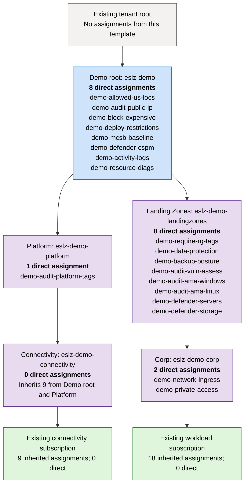

# Deploy the Always-Created Azure ESLZ Resources from the Azure Portal

This runbook deploys the governance-only, safe-default profile from
`main.bicep` in `azureeslzmultisubdemo`. The work is performed inside the Azure
portal by using Azure Cloud Shell.

> [!CAUTION]
> This is a **tenant-scope deployment**. It creates management groups, moves two
> existing subscriptions to new management-group parents, and creates Azure
> Policy objects that inherit to those subscriptions. Use sandbox subscriptions
> only. Review the tenant-scope what-if with an Azure administrator before
> deploying.

> [!IMPORTANT]
> Do not use the portal's generic **Deploy a custom template** resource-group
> workflow for this repository. `main.bicep` targets the tenant and deploys
> modules at management-group and subscription scopes. Use the portal's Cloud
> Shell and the repository's guarded scripts as described below.

## 1. What the safe-default deployment creates

The safe profile is based on
`parameters/demo.parameters.template.json`. "Always-created" below means the
resource is created when that profile is completed with real IDs and deployed
without enabling optional switches.

### 1.1 Management-group hierarchy

The existing tenant root is used only as the parent. No demo policy or role is
assigned to the tenant root.

| Resource | Management-group ID with `namePrefix=eslz-demo` | Parent |
|---|---|---|
| Demo root | `eslz-demo` | Existing tenant root |
| Platform | `eslz-demo-platform` | Demo root |
| Connectivity | `eslz-demo-connectivity` | Platform |
| Landing Zones | `eslz-demo-landingzones` | Demo root |
| Workload branch | `eslz-demo-corp` or `eslz-demo-online` | Landing Zones |

The deployment also creates two management-group subscription associations:

| Existing subscription | New parent |
|---|---|
| Connectivity sandbox subscription | Connectivity |
| Workload sandbox subscription | Corp or Online |

The deployment does **not** create subscriptions.

#### Hierarchy and directly assigned policies

This diagram shows the **19 assignments** created by the safe profile with
`namePrefix=eslz-demo` and `workloadArchetype=corp`. For the `online` archetype,
replace `eslz-demo-corp` with `eslz-demo-online`; the assignments are unchanged.
Each management-group box lists the assignment **resource names created directly
at that scope**. Section [1.4](#14-policy-assignments-created-by-the-safe-profile)
maps these groups to the display names shown in the portal and their safe posture.

Arrows show the parent-child hierarchy. Assignments inherit downward; they are
**not created again** at every child scope.



**Count direct assignments once:** 8 at Demo root + 1 at Platform + 0 at
Connectivity + 8 at Landing Zones + 2 at Corp/Online = **19**. Subscription counts
include only assignments inherited from this template, not any pre-existing
tenant policies. An initiative counts as one assignment regardless of how many
policies it contains; assignments with `Disabled` effects still count.

Optional additions are **not shown in the safe-profile diagram**:

| Scope | Optional assignment resource names | Opt-in |
|---|---|---|
| Demo root | `demo-cis-foundations`, `demo-nist-800-53-r5` | Respective CIS or NIST benchmark switch |
| Landing Zones | `demo-inherit-rg-tags`, `demo-vm-backup-<index>`, `demo-vault-diagnostics` | Respective tag inheritance, VM backup remediation, or vault diagnostics switch and required inputs; VM backup creates one assignment per approved vault entry |
| Corp/Online | `demo-firewall-routes` | `enableFirewallRouteGuardrails` and required inputs |
| Optional Critical Infrastructure child of Landing Zones | `demo-critical-private`; optionally `demo-critical-fw-routes` and `demo-nerc-cip-technical` | `enableCriticalInfrastructure` creates the branch and private-access assignment; firewall and NERC assignments require their own additional opt-ins and valid inputs |

### 1.2 Custom policy definitions

The following 10 custom definitions are stored at the new demo-root management
group:

| Definition | Purpose |
|---|---|
| Allowed US locations | Restricts regional resources to the approved continental-US list |
| Allowed resource types | Evaluates a customer-approved resource-type allowlist |
| Audit public IP | Reports public IP address resources |
| Public management ingress | Detects public inbound SSH and RDP NSG rules |
| Require subnet NSG | Detects workload subnets without an NSG |
| PaaS public network access | Audits selected PaaS services that allow public access |
| Approved firewall routes | Audits route-table expectations against an approved firewall |
| Block expensive resources | Covers selected costly resource types and disallowed VM SKUs |
| Storage approved CMK | Audits storage CMKs against approved vault/key inventories |
| Platform tags | Audits `Owner` and `CostCenter` tags |

With `namePrefix=eslz-demo`, their Azure resource names begin with
`eslz-demo-`.

### 1.3 Custom policy initiatives

The following eight initiatives are defined at the demo root:

| Initiative | Purpose | Assigned by default? |
|---|---|---|
| Required resource-group tags | Requires six governance tags on resource groups | Yes, at Landing Zones |
| Resource tag inheritance | Can copy six resource-group tags to child resources | No; definition only |
| Root deployment restrictions | Combines location, resource-type, VM SKU, disk, and public-IP controls | Yes, at demo root |
| Workload network ingress | Combines public SSH/RDP and subnet NSG controls | Yes, at Corp/Online |
| Workload private access | Combines PaaS public-access and private-link readiness controls | Yes, at Corp/Online |
| Data protection | Storage and Key Vault posture and CMK readiness | Yes, at Landing Zones |
| Backup posture | VM backup coverage and Recovery Services vault posture | Yes, at Landing Zones |
| NERC CIP technical overlay | Critical-infrastructure technical signals | No; definition only |

Creating an initiative definition does not itself evaluate or change resources.
An assignment determines where it applies.

### 1.4 Policy assignments created by the safe profile

The safe profile creates 19 assignments. Some assignments exist with a
`Disabled` effect so that later opt-in is explicit and repeatable. None of the
safe-default assignments starts a remediation task.

#### Demo root

These assignments inherit to Platform, Connectivity, Landing Zones, and both
supplied subscriptions:

| Assignment | Safe-default posture |
|---|---|
| Demo - allowed continental-US locations | Deny definition with assignment in `DoNotEnforce` |
| Demo - audit public IP resources | `Audit` |
| Demo - block common expensive resources and VM SKUs | Deny definition in `DoNotEnforce` |
| Demo - root deployment restrictions | Deny members in `DoNotEnforce`; audit members remain audit |
| Demo - Microsoft cloud security benchmark | Enabled assignment in `DoNotEnforce` |
| Demo - Microsoft Defender CSPM | Effect `Disabled`; role-less managed identity |
| Demo - export Activity Logs to Log Analytics | Effect `Disabled` |
| Demo - export supported resource diagnostics | Effect `Disabled` |

#### Platform

| Assignment | Safe-default posture |
|---|---|
| Demo - audit platform tags | `Audit` |

This assignment inherits through Connectivity to the connectivity subscription.

#### Landing Zones

| Assignment | Safe-default posture |
|---|---|
| Demo - require resource group tags | Initiative in `DoNotEnforce` |
| Demo - storage and Key Vault data-protection guardrails | Audit-oriented effects in `DoNotEnforce` |
| Demo - backup coverage and vault posture | `Audit` / `AuditIfNotExists` |
| Demo - audit VM vulnerability assessment | `AuditIfNotExists` |
| Demo - audit Windows Azure Monitor Agent presence | `AuditIfNotExists` |
| Demo - audit Linux Azure Monitor Agent presence | `AuditIfNotExists` |
| Demo - Microsoft Defender for Servers | Effect `Disabled`; role-less managed identity |
| Demo - Microsoft Defender for Storage | Effect `Disabled`; role-less managed identity |

These assignments inherit to the Corp/Online workload subscription.

#### Corp or Online workload branch

| Assignment | Safe-default posture |
|---|---|
| Demo - workload network ingress guardrails | `Audit` in `DoNotEnforce` |
| Demo - workload private access guardrails | Audit-oriented |

### 1.5 Deployment records

Azure Resource Manager also creates a tenant deployment record and nested
deployment records used to target the management groups and subscriptions.
These records are deployment history, not workload services.

## 2. What the safe profile does not create

Keep the settings in this runbook unchanged and the deployment does not create:

- Azure subscriptions or Microsoft Entra users/groups;
- Azure RBAC role assignments;
- resource groups, VNets, NSGs, VMs, disks, or public IPs;
- Log Analytics workspaces or Microsoft Sentinel onboarding;
- enabled paid Defender plans;
- Recovery Services vaults, backup policies, or protected backup items;
- policy exemptions;
- the Critical Infrastructure management group;
- policy remediation tasks;
- remediation RBAC grants for Defender or logging assignment identities;
- permanent or eligible Owner assignments.

Azure Cloud Shell may ask to create or mount its own storage when it is first
opened. That storage is a Cloud Shell prerequisite and is unrelated to this
Bicep deployment. Select an ephemeral/no-storage Cloud Shell session if your
portal offers it and you do not need the cloned files after the session.

## 3. Required approvals and access

Before starting, obtain approval for:

1. creating five child management groups beneath the tenant root;
2. moving the two sandbox subscriptions to the new hierarchy;
3. creating policy definitions, initiatives, and assignments at the demo root
   and descendant management groups;
4. the proposed `namePrefix`, which becomes part of management-group and policy
   resource names.

The deployment operator must already be authorized to:

- create child management groups below the tenant root;
- associate both subscriptions with new management-group parents;
- create tenant-, management-group-, and subscription-scope deployments;
- create policy definitions, initiatives, and assignments at the required
  management-group scopes.

Subscription Owner alone does not automatically grant management-group access.
Microsoft Entra Global Administrator also does not automatically grant Azure
resource access. If temporary elevated access is required, follow the
organization's privileged-access process and remove the elevation after the
deployment.

## 4. Collect the required values in the portal

Do not collect client secrets, passwords, or access tokens. The values below
are identifiers, but they should still be handled according to organizational
policy.

### 4.1 Tenant ID

1. Sign in to [Azure portal](https://portal.azure.com).
2. Search for **Microsoft Entra ID**.
3. Open **Overview**.
4. Copy **Tenant ID**.

### 4.2 Tenant-root management-group ID

1. Search for **Management groups**.
2. Open the hierarchy.
3. Select **Tenant Root Group**.
4. Copy its management-group ID.
5. Do not assume it is the Tenant ID even when the values appear identical.

### 4.3 Sandbox subscription IDs

1. Search for **Subscriptions**.
2. Open the sandbox subscription that will represent Connectivity.
3. Copy its **Subscription ID**.
4. Repeat for the sandbox subscription that will represent the workload.
5. Confirm the subscriptions are enabled, are in the same tenant, have
   different IDs, and can safely be moved from their current parents.

### 4.4 Existing Entra security-group object IDs

Although safe deployment keeps `deployRoleAssignments=false`, the template
still requires four distinct group object IDs:

1. Open **Microsoft Entra ID**.
2. Select **Groups** > **All groups**.
3. Open each approved security group.
4. Copy **Object ID**, not the group owner's ID.

Collect IDs for:

- governance administrators;
- network operators;
- workload contributors;
- read-only auditors.

## 5. Open and prepare Azure Cloud Shell

1. In the Azure portal header, select the **Cloud Shell** icon.
2. Select **Bash**.
3. If prompted, select the correct tenant and an approved Cloud Shell storage
   option. Cloud Shell storage is not part of the Bicep deployment.
4. Expand Cloud Shell so the what-if output is easy to review.
5. Verify the signed-in tenant and available tools using the appropriate block
   below. Installation commands are comments on the same line as each tool check;
   run them separately only if the tool is missing.

**Bash (Cloud Shell or local Ubuntu):**

```bash
az version # Missing on local Ubuntu: curl -sL https://aka.ms/InstallAzureCLIDeb | sudo bash
az account show --output table
az account list --all --output table
az bicep version # If missing: az bicep install
jq --version # Missing on local Ubuntu: sudo apt-get update && sudo apt-get install -y jq
rg --version # Missing on local Ubuntu: sudo apt-get update && sudo apt-get install -y ripgrep
git --version # Missing on local Ubuntu: sudo apt-get update && sudo apt-get install -y git
```

**PowerShell (Cloud Shell or local Windows PowerShell 7):**

```powershell
$PSVersionTable.PSVersion # Missing PowerShell 7 on Windows: winget install --exact --id Microsoft.PowerShell
az version # Missing on local Windows: winget install --exact --id Microsoft.AzureCLI
az account show --output table
az account list --all --output table
az bicep version # If missing: az bicep install
jq --version # Missing on local Windows: winget install --exact --id jqlang.jq
rg --version # Missing on local Windows: winget install --exact --id BurntSushi.ripgrep.MSVC
git --version # Missing on local Windows: winget install --exact --id Git.Git
```

Cloud Shell is a managed Linux environment, not an Ubuntu machine with `sudo`
access. The `apt-get` commands above are for local Ubuntu only; `winget` is for
local Windows only and is not available in Cloud Shell PowerShell. For PowerShell
running on local Ubuntu, use the Ubuntu installation commands instead. Cloud
Shell normally provides Azure CLI, Git, jq, ripgrep, and PowerShell; if a required
tool is missing there, restart the session or use an approved user-local install,
not `sudo`. `az bicep install` works in either shell. After local installations,
open a new terminal so PATH changes take effect; run `az login` if needed.

The rest of this runbook uses Bash syntax. Switch Cloud Shell back to **Bash**
before continuing if you used PowerShell for these checks.

Stop if the signed-in tenant is wrong, either sandbox subscription is missing,
or one of the required tools is unavailable. Do not bypass the repository's
tests or validation scripts.

## 6. Get the approved repository version

Use the repository URL and release/commit approved by your organization. The
project documentation currently uses the following upstream URL:

```bash
git clone https://github.com/johnstel/azureeslzmultisubdemo.git
cd azureeslzmultisubdemo
git status
git log -1 --oneline
```

If your organization deploys an internal fork, replace the URL with that fork.
Record the displayed commit ID in the change ticket.

## 7. Create the safe parameter file

Copy the safe template:

```bash
cp parameters/demo.parameters.template.json parameters/demo.parameters.json
```

Open the Cloud Shell editor:

```bash
code parameters/demo.parameters.json
```

Replace every `REPLACE_WITH_*` placeholder with the collected IDs. Set or
confirm:

| Parameter | Required safe value |
|---|---|
| `deploymentLocation` | Approved deployment-history region, for example `eastus` |
| `tenantRootManagementGroupId` | Existing tenant-root management-group ID |
| `namePrefix` | Unique lowercase prefix, 3-24 characters |
| `demoRootDisplayName` | Friendly portal name for the demo root |
| `workloadArchetype` | `corp` or `online` |
| `connectivitySubscriptionId` | Existing connectivity sandbox subscription ID |
| `workloadSubscriptionId` | Existing workload sandbox subscription ID |
| Four `*GroupObjectId` values | Four distinct existing Entra group object IDs |
| `denyPolicyEnforcementMode` | `DoNotEnforce` |
| `networkIngressPolicyEffect` | `Audit` |
| `dataProtectionPolicyEffect` | `Audit` |
| `deployRoleAssignments` | `false` |
| `deployEvidenceResources` | `false` |
| `enableTagInheritance` | `false` |
| `deployCentralLogAnalytics` | `false` |
| `deploySentinel` | `false` |
| `enableCriticalInfrastructure` | `false` |
| `criticalInfrastructureSubscriptionIds` | `[]` |
| `policyExemptions` | `[]` |
| `enableMicrosoftCloudSecurityBenchmark` | `true` |
| `enableCisAzureFoundationsBenchmark` | `false` |
| `enableNistSp80053Rev5` | `false` |
| `enableNercCipTechnicalOverlay` | `false` |
| `activityLogExportPolicyEffect` | `Disabled` |
| `resourceDiagnosticsPolicyEffect` | `Disabled` |
| `enableVmBackupRemediation` | `false` |
| `enableVaultDiagnostics` | `false` |
| `deployRecoveryServicesVault` | `false` |
| Every `enableDefender*` parameter | `false`, except configuration-only defaults that are ignored while their parent plan is disabled |

Save the file and verify that no placeholders remain:

```bash
rg 'REPLACE_WITH_' parameters/demo.parameters.json
```

The command must return no matches.

## 8. Run repository validation

Run the project's Linux validation suite:

```bash
./tests/test.sh
```

Expected result:

```text
All local validation and safety tests passed.
```

If a test fails, stop at the first error. Do not deploy by manually skipping
the failing test.

## 9. Run the read-only Azure preflight

```bash
./scripts/preflight.sh parameters/demo.parameters.json
```

Preflight should confirm:

- all required values are populated and correctly shaped;
- the two subscription IDs and four group IDs are distinct;
- both subscriptions are enabled and belong to the signed-in tenant;
- the tenant-root management group is visible;
- the operator's relevant policy permissions can be queried;
- the Bicep entry points compile.

Passing preflight does not replace administrator approval or what-if review.

## 10. Run and review tenant-scope what-if

```bash
./scripts/what-if.sh parameters/demo.parameters.json
```

Save the output to the change record if required by your organization. Review
the preview line by line.

### Expected additions

- five management groups beneath the existing tenant root;
- two associations that place the existing sandbox subscriptions under their
  intended leaf management groups;
- 10 custom policy definitions at the demo root;
- eight custom policy initiatives at the demo root;
- 19 safe-default policy assignments at the scopes listed in section 1;
- five role-less system-assigned identities for the three Defender plan
  assignments and the two logging assignments, required even with disabled effects;
- tenant and nested deployment records.

### Stop conditions

Do not deploy if what-if shows:

- a policy or role assignment at the tenant-root management group;
- any subscription other than the two approved sandbox subscriptions;
- deletion of an existing resource;
- an unexpected change to an existing management-group hierarchy;
- a resource group, VNet, NSG, VM, public IP, firewall, gateway, database, Log
  Analytics workspace, Sentinel onboarding, or Recovery Services vault;
- any RBAC role assignment;
- a role grant to a Defender or disabled logging assignment identity;
- a Critical Infrastructure management group;
- a policy exemption;
- a deny-capable assignment with enforcement mode `Default`;
- a deployment location, prefix, or object ID that differs from the approved
  change record.

Have an Azure administrator approve the reviewed what-if before continuing.

## 11. Deploy the governance-only profile

The supported deployment script reruns preflight and what-if before deployment.
In the same Cloud Shell session:

```bash
export ESLZ_DEPLOY_CONFIRMATION="DEPLOY-ESLZ-DEMO"
./scripts/deploy.sh parameters/demo.parameters.json
```

The script displays the demo root and both subscription IDs. Compare all three
values with the approved change record. When prompted, type the exact
`namePrefix`. Any other response cancels deployment.

Do not close Cloud Shell simply because the command appears quiet. The Azure
deployment continues in Azure after submission.

If Cloud Shell disconnects, inspect the existing deployment before retrying:

```bash
az deployment tenant list --output table
```

Do not submit a second deployment while the first one is still running.

## 12. Verify the management-group hierarchy in the portal

1. Search for **Management groups**.
2. Select **Refresh**.
3. Expand the new demo root.
4. Confirm the hierarchy is:

```text
<namePrefix>
├── <namePrefix>-platform
│   └── <namePrefix>-connectivity
│       └── connectivity sandbox subscription
└── <namePrefix>-landingzones
    └── <namePrefix>-corp | <namePrefix>-online
        └── workload sandbox subscription
```

5. Confirm no `<namePrefix>-criticalinfra` management group exists.
6. Confirm the tenant root has no new demo policy assignment.

Management-group and subscription movement can take several minutes to appear
consistently across the portal.

## 13. Verify custom policy definitions and initiatives

1. Search for **Policy**.
2. Open **Definitions**.
3. Set **Scope** to the new demo root.
4. Filter **Definition type** to **Custom**.
5. Confirm the 10 definitions listed in section 1.2.
6. Filter to initiative definitions and confirm the eight initiatives listed
   in section 1.3.
7. Confirm the definitions are stored at the demo root, not the tenant root.

## 14. Verify policy assignments and safe posture

In **Policy** > **Assignments**:

1. Set scope to the demo root and confirm the eight demo-root assignments.
2. Set scope to Platform and confirm the platform tag assignment.
3. Set scope to Landing Zones and confirm its eight assignments.
4. Set scope to Corp/Online and confirm its two direct assignments.
5. Open each deny-capable assignment and confirm **Enforcement mode** is
   `DoNotEnforce`.
6. Confirm Defender CSPM, Defender for Servers, Defender for Storage, Activity
   Log export, and supported-resource diagnostics have disabled effects.
7. Confirm no remediation task was created.
8. Expect compliance to show **Not started** or incomplete results until Azure
   Policy finishes its asynchronous evaluation.

You can also verify scopes from Cloud Shell:

```bash
PREFIX="eslz-demo" # replace if a different prefix was approved

az account management-group show \
  --name "$PREFIX" \
  --expand \
  --recurse \
  --output jsonc

az policy assignment list \
  --scope "/providers/Microsoft.Management/managementGroups/$PREFIX" \
  --output table

az policy assignment list \
  --scope "/providers/Microsoft.Management/managementGroups/${PREFIX}-platform" \
  --output table

az policy assignment list \
  --scope "/providers/Microsoft.Management/managementGroups/${PREFIX}-landingzones" \
  --output table

az policy assignment list \
  --scope "/providers/Microsoft.Management/managementGroups/${PREFIX}-corp" \
  --disable-scope-strict-match \
  --output table
```

Replace the last suffix with `online` when `workloadArchetype=online`.

## 15. Verify that optional resources were not created

1. Search for **Resource groups**.
2. Filter by each sandbox subscription.
3. Confirm there is no resource group named:
   - `rg-<namePrefix>-connectivity-demo`;
   - `rg-<namePrefix>-<corp|online>-demo`;
   - `rg-<namePrefix>-monitoring`;
   - `rg-<namePrefix>-backup`.
4. Search for **Role assignments** at the demo root and both subscriptions;
   confirm the deployment created none.
5. In **Policy** > **Remediation**, confirm no remediation task exists for the
   demo assignments.
6. In **Policy** > **Exemptions**, confirm no demo exemption exists.
7. In **Microsoft Defender for Cloud** > **Environment settings**, confirm the
   deployment did not enable paid plans.

## 16. Record completion

Attach the following evidence to the change record:

- deployed Git commit ID;
- completed tenant deployment name and status;
- approved what-if output;
- management-group hierarchy screenshot;
- policy definition/initiative inventory screenshot;
- assignment scopes and enforcement modes;
- confirmation that no optional resource groups, RBAC assignments, policy
  exemptions, or remediation tasks were created.

Keep the completed parameter file out of source control. When Cloud Shell uses
ephemeral storage, close the session after collecting required evidence. When
persistent Cloud Shell storage is used, remove or protect the local parameter
file according to the organization's data-retention policy.
